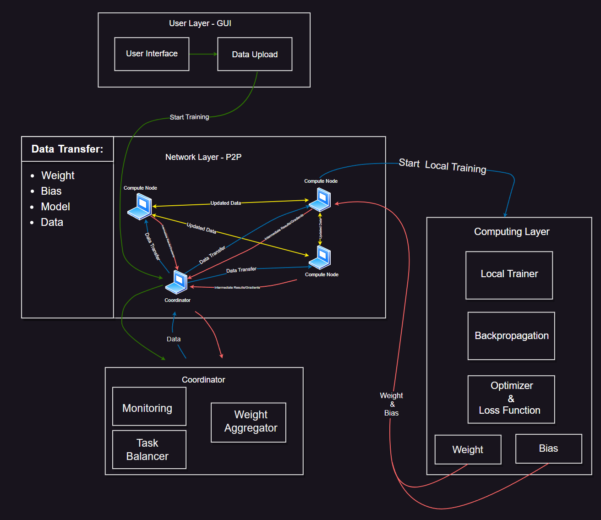

# PeerAI

## System Architecture

Below is the system architecture diagram for the project:



## Running the Project

### Prerequisites
1. **Install Python**: Ensure Python 3.10+ is installed.
2. **Install Dependencies**:
   Run the following command to install required libraries:
   ```bash
   pip install -r requirements.txt
   ```
### Steps to Run
1. Navigate to the project directory:
  ```bash
  cd /path/to/PeerAI
  ```
2. Run the application:
   ```bash
   python -m App.app
   ```


